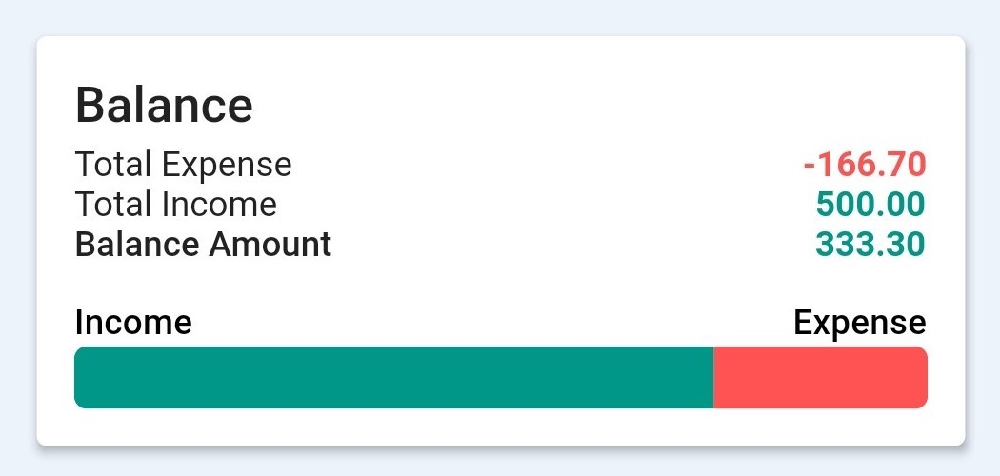

# About
Snapsheet prides itself as a **minimalistic expense tracker with a powerful localised (Singapore) receipt scanner.** The app seeks to cut down manual tasks of keying in receipts as well as introducing a new experience of recording personal or committee-related finances.

# Installation
Beta version.
[Click here to download the APK](https://drive.google.com/uc?export=download&id=1WFTm-UPCi7RhvnlDkQC0C_UtHNXzaGBT)

# Features

1. [Calculator](#calculator)
2. [Statistics](#statistics)
3. [Scanner](#scanner)
4. [Bulk-Scan Receipts](#bulk-scan-receipts)
5. [Export](#export)
6. [Custom Dashboard](#custom-dashboard)
7. [Custom Category](#custom-category)
8. [Recurring Record](#recurring-record)
9. [Advanced Filter](#advanced-filter)
10. [Cloud Storage](#cloud-storage)
11. [Demo Mode](#demo-mode)

## Calculator
*If the scanner feels a bit too much, the calculator is a comfier alternative!*  
Have calculations on the spot and manually add expenses.  
Also, the calculator is sentient enough to not make records out of "edge" values (like 0 or Infinity).     

## Statistics
*Yes, it's hard to make sense out of all text but no visualisation... *
Statistics here visualises a summary of users' expenses in each accounts.  
What Statistics is all about:
- Balance: shows income, spending and the net cashflow of the user.  
- Expenses breakdown: shows the total spending for each category.  
- Amount trend: shows the total amount at a given time of the account.     

  

## Scanner
*It's called SNAPsheet for a reason. Ha!  *
Our scanner is meticulously equipped with an original parser!  
It takes an image of a receipt (gallery or camera) and automatically make a sensible record out of it for you.  
What it detects:
- (Singapore) shop names
- Total cost
- Date
- Category of the shop

## Bulk-Scan Receipts
*Need to scan a lot? We've got you covered!*  
Scan multiple receipt images form the gallery and extract each data all at once.   
Review and fix the captured data before all the receipts land to any account.  
If a record has a receipt image in the cloud, a quick-access receipt icon lets you view the image directly.     

## Export
*Maybe you're an accountant? A treasurer?*  
Export expenses in CSV format if you need to share your expenses details to others.     

## Custom Dashboard
*Less is more, yo.*   
Give users freedom over what features of Statistics are visible in their Dashboard.    

## Custom Category
*Get creative with your own categories and play around with hundreds of available icons!*   
Snapsheet has pre-defined 10 default categories that cannot be messed around with...   
If you feel you need to make new categories, Snapsheet gives you the chance!   
Play around with a wide selection of colors and icons to create custom categories.    

## Recurring Record
*When some records are just a part of your life.*  
Create a recurring expense/income, and let Snapsheet input it manually into an account.    

## Advanced Filter
*Suddenly, you realise that a record you put in 3 weeks ago has the wrong details!*  
Filter the records to view based on other complex parameters: category, time, amount, date.    

## Cloud Storage for Receipts
*Love your local gallery. Don't dump receipts into it.*   
Keep all receipt images safe in the cloud (instead of with other personal pictures of yours).    

## Demo Mode
*Mess around with Snapsheet before you use it for real!*   
Explore the app with some dummy demo data and exit it when you're ready.    

# Team

# FAQs
